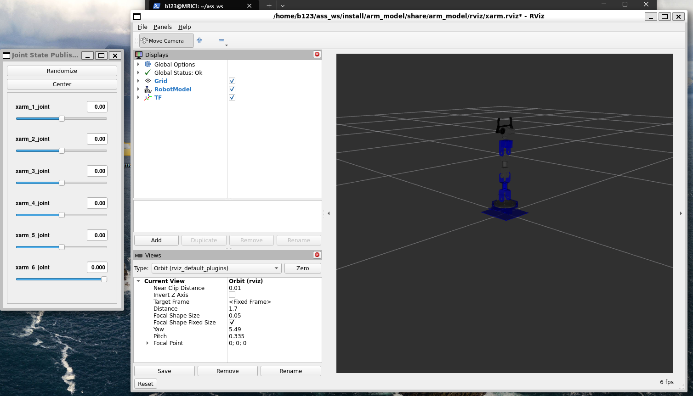

# Arm_model

This repository provides URDF models for two robotic arms: **Xarm** and **Learm**. It includes ROS 2 launch files for visualizing and interacting with the robot models using `joint_state_publisher_gui` and RViz2. Users can easily launch either robot in a simulated environment and manipulate the joints via a graphical interface.

## Installation

Make sure you have [ROS 2 Humble](https://docs.ros.org/en/humble/Installation.html) installed.

Install required ROS 2 packages:
```sh
sudo apt install ros-humble-joint-state-publisher-gui ros-humble-robot-state-publisher ros-humble-rviz2 ros-humble-xacro
```

Clone this repository and build the package:
```sh
cd ~/ros2_ws/src
git clone https://github.com/rick55654/arm_model.git
cd ~/ros2_ws
colcon build
source install/setup.bash
```

## Usage

To launch the **Learm** model with GUI:
```sh
ros2 launch arm_model learm.launch.py
```

To launch the **Xarm** model with GUI:
```sh
ros2 launch arm_model xarm.launch.py
```

## Example Result

Below is an example screenshot of the robot model visualized in RViz2:



---

## Credits

This package is based on and modified from the following repositories to match the real robotic arms in our laboratory:

- [andrewda/learm_ros2](https://github.com/andrewda/learm_ros2)
- [andrewda/xarm_ros2](https://github.com/andrewda/xarm_ros2)
